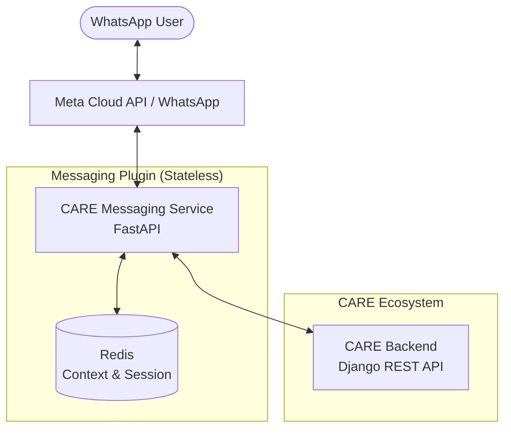

# 🏥 CARE Messaging Service (External Plugin)

[](https://summerofcode.withgoogle.com/)
[](https://fastapi.tiangolo.com)
[]()
[](https://opensource.org/licenses/MIT)

An external, decoupled messaging service for the **Open Healthcare Network (OHN) CARE** platform. This plugin enables stateful, automated communication via platforms like **WhatsApp** while maintaining a strict separation from the CARE core backend.

---

## 🏗️ Clean Project Architecture

This project follows a professional **Layered Architecture** to ensure maintainability, scalability, and testability. It is built as a stateless service that leverages REST APIs to interact with the CARE backend.



### 📂 Directory Structure

```text
care-im-service/
├── app/
│   ├── interfaces/     # External platform adapters (WhatsApp, providers)
│   ├── application/    # Stateful orchestration (Intent Dispatcher)
│   ├── services/       # Domain business logic & data formatting
│   ├── clients/        # Infrastructure & CARE REST Client
│   ├── core/           # Domain models, registry, and config
│   ├── auth/           # OTP & Session Lifecycle management
│   └── tasks/          # Asynchronous workers (Celery)
├── tests/              # Full unit testing suite (Mocked API Client)
├── docker-compose.yaml # Multi-container production setup
└── README.md           # Documentation
```

---

## ✨ Key Features

- **✅ Platform Agnostic**: Modular provider system for WhatsApp, Telegram, or SMS.
- **🔐 Secure Linking**: OTP-based authentication using CARE's internal User APIs.
- **📊 Real-time Data**: On-demand access to Medications (`/meds`) and Patient Records (`/records`).
- **🧠 Contextual Intents**: Pluggable `IntentRegistry` with state-machine support for complex workflows.
- **⚡ Proactive Notifications**: Celery-powered async triggers for patient alerts.
- **🛡️ Privacy First**: Never stores Protected Patient Information (PPI). Access is gated by fresh JWT tokens.

---

## 🛠️ Tech Stack

- **Framework**: [FastAPI](https://fastapi.tiangolo.com/) (Async, Type-Safe)
- **State/Cache**: [Redis](https://redis.io/) (Session persistence)
- **Task Queue**: [Celery](https://docs.celeryq.dev/)
- **API Communication**: [Requests](https://requests.readthedocs.io/) & [HTTPX](https://www.python-httpx.org/)
- **Configuration**: [Pydantic Settings](https://docs.pydantic.dev/latest/usage/pydantic_settings/)
- **Testing**: [Pytest](https://pytest.org/) with `requests-mock`
- **Deployment**: [Docker](https://www.docker.com/) & [Docker Compose](https://docs.docker.com/compose/)

---

## 🚀 Getting Started

### 📋 Prerequisites
- Python 3.10+
- Redis (running locally or via Docker)
- A Meta Cloud API account (for WhatsApp functionality)

### ⚙️ Installation

1.  **Clone the repository**:
    ```bash
    git clone https://github.com/MeenalSinha/care-im-service.git
    cd care-im-service
    ```

2.  **Install dependencies**:
    ```bash
    pip install -r requirements.txt
    ```

3.  **Configure Environment Variables**:
    Copy the example `.env`:
    ```bash
    cp .env.example .env
    ```
    Update `.env` with your `CARE_API_BASE_URL`, `WHATSAPP_ACCESS_TOKEN`, and `REDIS_URL`.

4.  **Launch the Service**:
    Using Docker (Recommended):
    ```bash
    docker-compose up --build
    ```
    Or manually:
    ```bash
    uvicorn app.main:app --reload
    ```

---

## 🧪 Testing

The service includes a robust testing suite that mocks the CARE API to ensure logic reliability.

```bash
pytest tests/
```

---

## 🏛️ GSoC 2026 Context

This project is part of a **GSoC 2026** contribution to the **Open Healthcare Network**. The core objective is to move the IM messaging system into a dedicated, external plugin to ensure the CARE core system remains lean and modular.

### 🎯 Project Goals:
1.  **Modularization**: Decouple messaging from CARE core models.
2.  **Scalability**: Enable easier onboarding for new messaging providers.
3.  **Standardization**: Use standard REST API interactions for all clinical data.

---

## 📜 License

This project is licensed under the **MIT License**.

## 🤝 Contribution

Contributions are welcome! Please follow the standard workflow:
1. Fork the repo.
2. Create your feature branch (`git checkout -b feature/AmazingFeature`).
3. Commit your changes (`git commit -m 'Add AmazingFeature'`).
4. Push to the branch (`git push origin feature/AmazingFeature`).
5. Open a Pull Request.
